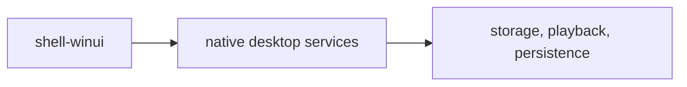

# Native Desktop Architecture Contract

This document replaces the old WinUI + WebView2 bridge plan.

## Layers

1. `shell-winui`
2. native desktop services
3. storage / playback / persistence modules

## Ownership

### `shell-winui`

- owns fixed desktop layout
- owns native navigation and editor surfaces
- owns drag/drop, pickers, and floating windows
- does not delegate shell composition to embedded web content

### Native desktop services

- own playback orchestration
- own import and file management
- own settings and hotkey registration
- own database access

### Storage / playback / persistence modules

- remain UI-agnostic where practical
- do not depend on Electron renderer or WebView host objects

## Rule of Use

- New V1 features should enter through native desktop UI first.
- A browser host is not an acceptable default implementation path.
- Legacy web code can be referenced, but it does not define the shipped architecture.
